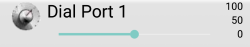
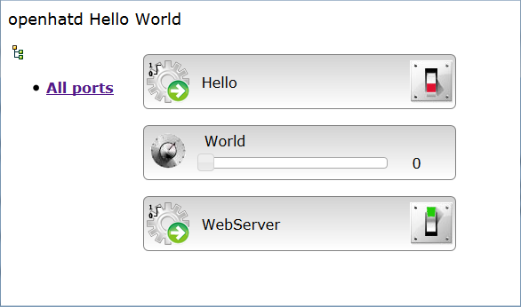
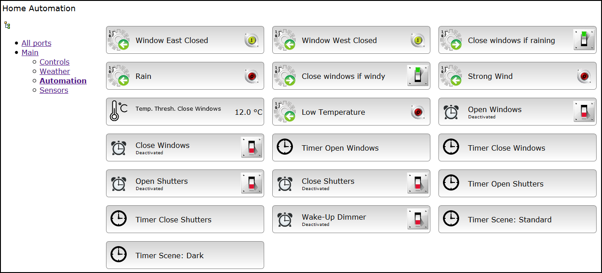

In order to use openhatd it is necessary to understand some basic concepts. This will also give you some understanding of openhatd's flexibility and limitations.

## Ports 

The basic automation building block in openhatd is called a **Port**. Everything in openhatd revolves around the configuration of ports, their current state and their connections to other ports. Ports encapsulate simple or advanced behavior and get or provide information from or to other ports. It is the combination of ports that makes complex automation behavior possible.

You can think of ports as internal variables of the system. Ports can be exposed on a user interface, giving read-only or writable access to the user. openhatd can automatically log the values of ports. At the same time, ports do implement the system's functionality, for example window operation state machines, weather data file parsing etc.

There are different types of ports in openhatd. To be able to model automation behavior with ports you'll have to understand these different types of ports and their properties and functions. The basic properties of all types of ports are:

 - A unique **ID** which is a text string preferably without blanks and special characters, for example "Window1"
 - A **hidden** flag which decides whether to display this port on a user interface or not
 - An optional **label** and **icon** specification to display on a user interface (if the port is not hidden)
 - An optional **unit** specification which determines value conversions, formatting etc.
 - A **readonly** flag which decides whether a user may change this port's value or not
 - A **persistent** flag which decides whether the state of this port is stored permanently in an external file
 - An optional **group** ID (ports can be ordered into hierarchical groups)
 - A **refresh mode** that decides how changes in the port's state affect the connected user interfaces
 - Freely assignable **tag** values

Port IDs should contain only upper- and lowercase characters, digits, and the underscore. They should not start with a digit. The technical reason for this is that port IDs can be referred to from within expression formulas and other constructs which use a certain syntax. Using special characters in port IDs might interfere with this syntax. Additionally, port IDs are case sensitive in some contexts but may not be in others. For this reason (and for readability) it is strongly discouraged to rely on port ID case sensitivity.

Ports can have **errors**. This is normal because many ports interact with resources of the environment or external components that may fail or become unavailable. openhatd provides mechanisms to gracefully deal with such errors. See [Port Overview - Errors](ports.md#port_errors) for more details. 

Basically, ports are of five different types:

### Digital Port

The Digital port is the most elementary port type. A Digital port has a **Mode** and a **Line** state. Modes can be **Input** and **Output**, and the line can be either **Low** or **High**. Mode and Line default to Input and Low.

The Digital port is modeled after a digital I/O pin of a microcontroller. The important thing here is that a Digital port's state is always known, and it is either Low or High. Basically, the Digital port models a switch. In openhatd it is used for "things that can be on or off", no matter whether the state of these things is controlled directly by a user or by internal functions, or whether the Digital port is a physical actor, an internal variable or behavioral component or reflects the state of some outside sensor (by reading its state from some driver).

Typical examples of Digital ports are LEDs or relays (output only), and switches or buttons (input only). However, most higher-level functions in openhatd are also modeled as Digital ports, thus giving you the ability to switch these functions on or off. For example, a Pulse port can periodically change the state of one or more Digital ports (its "outputs"). The Pulse port itself is again a Digital port, and it will only be active if its Line state is High. Thus, you can switch the Pulse port on or off using a user interface, or the Pulse port can again be controlled by any other port that accepts a Digital port as an output. In this way you can connect elementary blocks together to form complex behavior.

### Analog Port

The Analog port is modeled after the the properties of an A/D or D/A port of a microcontroller. Its value ranges from 0 to 2^n - 1, with n being a value between 8 and 12 inclusively.
The Analog port also has a **Reference** setting (internal/external), and a **Mode** (input/output). The Analog port is less useful in an openhatd automation context because it is modeled so close to the metal. In most cases it is better to use a Dial port instead.

### Dial Port

The Dial port is the most versatile and flexible port. It represents a 64 bit signed integer value referred to as **Position**. There's a **Minimum**, **Maximum** and a **Step** setting which limit the possible values of a Dial port to a meaningful range; for example, to represent an ambient temperature in degrees Celsius you could limit the range to -50..50. The defaults are 0, 100 and 1 for Minimum, Maximum and Step.

openhatd does not do floating point arithmetics internally. You therefore cannot store fractional values in ports. This is not a problem in practice, though; if you need to represent for example tenths of degrees Celsius you could specify the above range as -500..500 and divide the value by 10 for all internal calculations. If the value has to be presented to a user the conversion happens in the UI component; the port's unit specification tells the UI what the value is exactly and what options there are for converting and formatting the value. This also helps with localizing the UI; for example, even though the value is processed internally as tenths of degrees Celsius the UI might choose to display it as degrees Fahrenheit, by means of a conversion routine specified for this unit. The most important thing here is to remember what the internal value actually means for a specific Dial port.

Dial ports can represent numeric information as well as dates and times. As usual with openhatd ports, the value of a Dial port might be set by a user, or it might be the result of an internal calculation, or it might reflect the state of some hardware or other external component (like the content of a file). The best way to initially think about a Dial port is as of a universal numeric variable.

### Select Port

The Select port represents a set of distinct **labeled options**. The currently selected option number is referred to as **Position**, starting with 0. Its most useful application is to present the user with a choice; however, the Select port can also have internal uses. The most important difference to the Digital port is that the Select port can represent things that do not necessarily have a known state. Take, for example, a radio controlled power socket. The radio control is one-way only in most cases, so there is no way to know whether the power socket is actually on or off; its state is essentially unknown. Such a device can not be modeled with a Digital port as a Digital port must have a known state. It can, however, be conveniently modeled using a Select port with three options: Unknown, Off, and On. If the user selects Off or On the command is sent to the socket via radio, but the Select port's state will not reflect the user's choice but instead remain Unknown.

A Select port supports up to 65535 different labels (or states), but for practical purposes it is recommended to keep this number as low as possible.

### Streaming Port

A Streaming port can be used to transfer text or binary data. Its use in openhatd, for now, is very limited.

## Server Process Lifecycle

At startup openhatd reads the specified configuration file and builds up a list of ports that are to be used for the automation model. This is called the **configuration phase**. Once all ports have been configured openhatd will reorder them according to the configuration and enter the **preparation phase**. During this phase each port is given the opportunity to initialize itself, allocate necessary resources, and, most importantly, resolve references to other ports that have been specified. Any errors during configuration and preparation cause openhatd to exit.

Once preparation is complete openhatd will enter the **running phase**. In this phase openhatd listens for control connections from other devices (using the OPDI protocol, see below). It also periodically iterates through all ports that have been created and registered during the initialization process. This is called the **doWork loop**. The doWork loop gives each port the possibility to check for necessary actions or system changes that require any reactions. 

openhatd will listen to operating system signals to determine when it is about to be terminated. After it receives a termination or interrupt signal it will loop through all ports to give them a chance to perform cleanups or persistence tasks before the program finally exits. 

## Time in openhatd

openhatd is not a real time system. For operations that must be regularly timed (such as periodic refreshes of port state, timer actions, pulses etc.) the most finely grained unit is the millisecond. Some settings do have to be specified in milliseconds, others in seconds (depending on what makes more sense). However, there is no guarantee that a specified duration in openhatd is exact, but it is guaranteed not to be shorter.

Measuring time is platform dependent. On Windows the time resolution may be reduced to 10-16 milliseconds. On Linux the granularity is usually better.

Depending on the number of ports and how they are configured an iteration of the doWork loop requires a certain amount of time to process. The length of the doWork iterations determines the response delay in which ports can act; for example, if you specify a Pulse port with a duration of 100 milliseconds while a doWork iteration already requires 200 milliseconds to run, the Pulse port will not be able to keep up its 100 milliseconds duration. Instead, it will run with a lower time resolution which means that the pulses will be longer than specified.

In analogy to computer game programming, the number of doWork iterations per seconds are called "frames per second" or **fps**. Having openhatd run at a high fps rate gives you a finer granularity of the time slices and consequently more precision. It also consumes more CPU cycles and more power in turn, and most of the time it is not really necessary. openhatd allows you to specify a target fps rate that the system tries to attain by putting the process to sleep for the rest of the time if the doWork loop runs faster than required. This is done by measuring the current doWork duration and comparing it against a set target fps rate. The sleep time is adjusted based on this comparison. It may take quite some time until the defined target fps rate is actually reached (easily one hour or so). For a long-running server this is usually not a problem. This mechanism currently works on Linux only.

Generally it is recommended to set the fps rate fairly low, to maybe 10 or 20 (this is the default value). Doing so saves CPU power while still giving you a resolution of 50 to 100 milliseconds which is enough for most applications. In Debug log verbosity, openhatd will output warnings if the doWork loop consumes a lot of CPU time.

## The OPDI protocol

openhatd uses the Open Protocol for Device Interaction (OPDI) to receive commands. This protocol defines a handshake procedure to establish a connection between devices. After connecting, the slave, in this case the openhatd server, sends a list of ports along with their properties to the controlling master. The master builds a user interface from this data and allows the user to interact with it, for example to change values or switch states. These commands are then transferred to the slave which updates its internal state.

OPDI is a lightweight protocol originally designed for small devices like microcontrollers. It supports encryption and a username/password login mechanism. It does, however, not support an unlimited number of characters per message. Also, the number of ports is limited. The limits are set at compile time to reasonably high defaults so it's unlikely to run into problems unless you are using a very large number of ports.

openhatd also contains a WebServer plugin that gives you an HTML/JavaScript GUI to interact with the server. This GUI does not have the restrictions of the OPDI protocol but is not as lightweight and therefore a little slower. The WebServer plugin also provides a JSON-RPC API. 

## Configuration Files

openhatd is configured using text files in the INI file format. This format defines **sections** in square brackets and properties in the format `key = value`:

	[Example_Section]
	Example_Key = Example_Value

The character encoding for configuration files is UTF-8. This encoding is used internally for all text in openhatd. The line endings may either be Windows (CRLF) or Unix (LF). Values are normally trimmed for whitespace. If blanks are required to appear at the beginning or end of a value they must be put in quotes:

	Key = "Value: "

Configuration sections in openhatd ini files are referred to as ***nodes***. (The terms "node" and "section" mean roughly the same thing.)

The main configuration file must contain some required nodes and properties (properties are also called **settings**). These are the `General` node, the `Connection` node and the `Root` node. The `General` node tells openhatd about some basic properties of the system:

	[General]
	SlaveName = openhatd Hello World

[More information about the General section](configuration.md#general)

The `Connection` node specifies the connection settings to be used by the OPDI protocol implementation:

	[Connection]
	Transport = TCP
	Port = 13110

[More information about the Connection section](configuration.md#connection)

Finally, the `Root` node specifies the nodes that are used for the automation model:

	[Root]
	Hello = 1
	World = 2
	WebServer = 3

This example `Root` section specifies that the `Hello`, `World` and the `WebServer` nodes should be evaluated in this order (the setting value must be a number specifying the position in the list; it is not required that these numbers be unique).

	[Hello]
	Type = DigitalPort
	Mode = Output

	[World]
	Type = DialPort

	[WebServer]
	Type = Plugin
	Driver = ../plugins/WebServerPlugin/WebServerPlugin
	Readonly = true

The most important setting of these nodes is the `Type` setting. This setting tells openhatd how to deal with this node. Nodes do not always correspond with ports in the automation model. A node specification can result in one or more ports, or no ports at all, depending on its type and function.

In this example, the node `Hello` specifies a simple Digital port that is configured as an output. The output mode has an effect on the GUI in that it displays an interactive element while the input mode does not. `World` defines a Dial port with default settings. `WebServer` specifies that a plugin called "WebServerPlugin" should be loaded using the dynamic library at the specified path. The path is relative to the current working directory of the openhatd executable. The WebServer provides access to an HTML GUI and is itself a Digital port which is only active if its Line is High; to avoid the user inadvertently disabling the WebServer via the UI we set it to read-only.

To run openhatd you have to specify a configuration file using the `-c` command line option:

	$ openhatd -c hello-world.ini

When running the above example, openhatd's output will be something like:

	[2016-11-29 12:00:32.495] openhatd version 0.1.0
	[2016-11-29 12:00:32.520] Listening for a connection on TCP port 13110

If you specify the `-d` command line flag (for "Debug") openhatd will output rather verbose information about how it reads the configuration settings.

Open a browser and point it to [localhost:8080](http://localhost:8080). You should see the following GUI:

You should be able to change the settings of the "Hello" and the "World" port by clicking on the UI (JavaScript needs to be enabled).

If you have the AndroPDI Remote Control app for Android, you can connect to openhatd by adding a new TCP/IP device and entering your test PC's host name.

## Log Verbosity 

openhatd can be configured to output more or less information about its operation using the `LogVerbosity` setting in the `General` section, or command line flags. The last command line flag counts and takes precedence over the configuration file setting.  

 	[General]
	LogVerbosity = Debug

The log levels are somewhat loosely defined from lowest to highest (a higher log level includes the lower levels):

- `Quiet` (`-q` on the command line): The absolute minimum. Only warnings and errors are logged.

- `Normal` (default, no special command line flag): Fairly minimal logging with limited information. Use this setting when a system is stable and you expect no issues.
 
- `Verbose` (`-v` on the command line): Recommended if some amount of information is required. Will log important non-regular events (i. e. events that occur due to user interaction, or happen infrequently) plus some technical information. Suitable for monitoring a system in production when issues are expected.
 
- `Debug` (`-d` on the command line): Will additionally log less imortant regular events plus more detailed technical information, but not from within the doWork loop. Logs access to configuration settings which is especially useful when troubleshooting included configuration files with substituted parameters. Can produce a large amount of log messages. Recommended for testing or troublehooting if you need additional hints about system behaviour, but not for normal operation.
 
- `Extreme` (`-e` on the command line): Will additionally output messages from the inner doWork loop. This level will generate log messages in every frame and will quickly produce a lot of output. Recommended for isolated testing in very special circumstances.
 
For example, the log output in `Verbose` mode of the above example is:

	[2016-11-29 16:42:52.801] openhatd version 0.1.0
	[2016-11-29 16:42:52.810] Setting up root nodes
	[2016-11-29 16:42:52.813] Setting up node: Hello
	[2016-11-29 16:42:52.821] Setting up node: World
	[2016-11-29 16:42:52.830] Setting up node: WebServer
	[2016-11-29 16:42:52.835] Loading plugin driver: ../plugins/WebServerPlugin/WebServerPlugin
	[2016-11-29 16:42:52.855] WebServer: Setting up web server on port 8080
	[2016-11-29 16:42:52.858] WebServer: WebServerPlugin setup completed successfully on port 8080
	[2016-11-29 16:42:52.862] Node setup complete, preparing ports
	[2016-11-29 16:42:52.864] Setting up connection for slave: openhatd Hello World
	[2016-11-29 16:42:52.870] Listening for a connection on TCP port 13110

Individual nodes or ports can specify their own log levels which then take precedence. This allows you to selectively increase or decrease log levels for certain ports independent from the general configuration. The individual port log levels do even override the command line flag. Use them for debugging and testing only.

## Groups

Groups are useful if there are many ports and you need some kind of logical structure to make them more manageable. A port can be assigned to exactly one group. Groups have an ID, a label and an optional parent group which allows you to construct hierarchies of groups. How exactly groups are presented to the user is up to a GUI implementation; however, the intended way is to show a tree of labels for the user to choose from, and to display the ports of the selected group node and all of its sub-groups.

Here's an example for group usage:

The groups are displayed on the left. Selecting a group shows only the ports associated with this group and its sub-groups.

Groups are defined as nodes in the `Root` section. Their `Type` is set to `Group`. This example defines two groups, `MainGroup` and `DigitalPorts`:

	[Root]
	MainGroup = 1000
	DigitalPorts = 1001

	[MainGroup]
	Type = Group
	Label = Main Ports
	
	[DigitalPorts]
	Type = Group
	Label = Digital Ports
	Parent = MainGroup
       
Port nodes can refer to groups by specifying the `Group` property:

	[DigitalTest]
	Type = DigitalPort
	Group = DigitalPorts	

`DigitalPorts` is a sub-group of `MainGroup`, meaning that if `MainGroup` is selected on a GUI all of its ports will be shown as well. If, however, `DigitalPorts` is selected only its own ports are displayed.    

## Persistent Settings

The state of ports can be persisted, i. e. saved to a separate configuration file, whenever the port state changes. This allows an automation model to store user preferences that are permanent over reboots or process restarts. It does not matter whether the state change is the result of a user interaction or of an internal function; however, it is recommended to persist the state of ports that are changed by the user only. State persistence requires loading and saving of files with the corresponding disk I/O, and if many changes need to be saved it not only introduces additional system load but may also wear out SD cards or other storage media unneccessarily.

Ports update the persistent configuration file whenever some relevant state changes occur. For a Digital port for example, this is the change of Mode and Line. For a Dial port it is the change of its value.

The persistence file must be defined in the `General` section:

	[General]
	...
	PersistentConfig = openhat-persistent.txt

To make a port's state persistent it is enough to set its `Persistent` setting to `true`:

	[APort]
	...
	Persistent = true
  
openhatd will try to read the port's state from the persistent file first. Only if it is not present it will read the initial state from the configuration file.

The persistent configuration file does not use the INI file format (for technical reasons). It uses Java property files with the following format:

	section.property = value

On systems that use an SD card as their primary storage care should be taken to put the persistent configuration file into a ramdisk and save/restore to/from SD card on stopping and starting the openhatd service to reduce SD card wear.

## Unit Specifications 

Units are a very important concept in openhatd. A port's unit specification tells a user interface how to present the value to the user. Units apply to numeric values only, i. e. they are useful with Analog and Dial ports. They are not validated or used for internal purposes in openhatd, so they are basically tags or labels that can be anything; but as they are hints for client UIs you should make sure that UIs understand the specified units. 

Units are specified for ports using the `Unit` setting. Example:

	[APort]
	...
	Unit = electricPower_mW

A unit setting does not directly specify how the value should be presented on a GUI. After all, there should be a way for the user to specify preferred visualizations depending on local language, unit systems etc. A unit to the client GUI therefore specifies a list of **unit formats** to choose from. A unit format is a specification that tells the GUI about the default label, the icon, the formatting of numeric values, and optional conversion routines that can be applied to this value.

It is important to remember this distinction. A **unit** is a label that tells a UI which **unit formats** can be applied to the value to create a meaningful representation for the user.

A unit's name should consist of two parts: what it is, and preferably its SI unit, separated by an underscore. Examples: `temperature_degreesCelsius`, `electricPower_mW`. A client needs to maintain a list of unit formats for each units. The list specification for `electricPower_mW` may look like this:

	  electricPower_mW_in_W=0;electricPower_mW_in_mW=1

This specification tells the GUI that there are two unit formats for `electricPower_mW`, namely `electricPower_mW_in_W` and `electricPower_mW_in_mW`, with `electricPower_mW_in_W` being the preferred one.

Units and unit formats are localized, meaning they are stored in locale-dependent files. The English (default) unit format specifications for the example look like this:

	electricPower_mW_in_W:
        layout=dial_port_row_noslider;icon=powermeter;label=Electric Power (W);formatString=%.1f W;denominator=1000

	electricPower_mW_in_mW:
        layout=dial_port_row_noslider;icon=powermeter;label=Electric Power (mW);formatString=%.0f mW
 
Without going too much into the details here you can see that the unit formats contain a layout hint, an icon and default label specification, a simple conversion (`denominator=1000`) plus format strings that specify different numbers of decimals.

## Localization

openhatd provides localized GUIs that can take a user's language and other preferences into account. However, there are some items like labels, error details or other messages that are generated by the server. As the server does not know about the locales of users it cannot provide localized texts to all of them.

openhatd partly supports the localization of these items and it is planned to improve this further. The restriction is that there is one server locale and all localized resources will be provided according to the rules of this locale.

## Data Logging and Visualization

Most of the time, if you run an automation system, you are interested in time series data. openhatd provides several ways to log data. For one, you can use a [Logger port](ports/logger_port.md) to regularly append the state of selected ports to a CSV file. You can then process this data using any specialized tools you like.

Additionally, openhatd provides the [InfluxDB port](ports/influxdb_port.md) which can send data to an [InfluxDB](https://www.influxdata.com/time-series-platform/influxdb/) instance via its HTTP API. InfluxDB is an open source time series database which is very easy to setup and manage.

InfluxDB data can be conveniently visualized using the open source tool [Grafana](http://grafana.org/). Grafana supports InfluxDB out of the box and allows you to configure dashboards and graph panels within minutes to create beautiful representations of your automation data.

