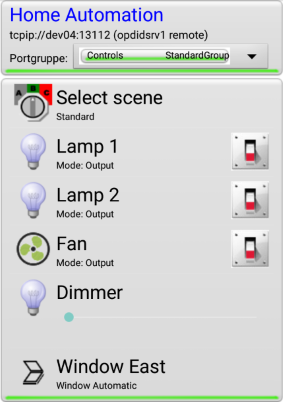
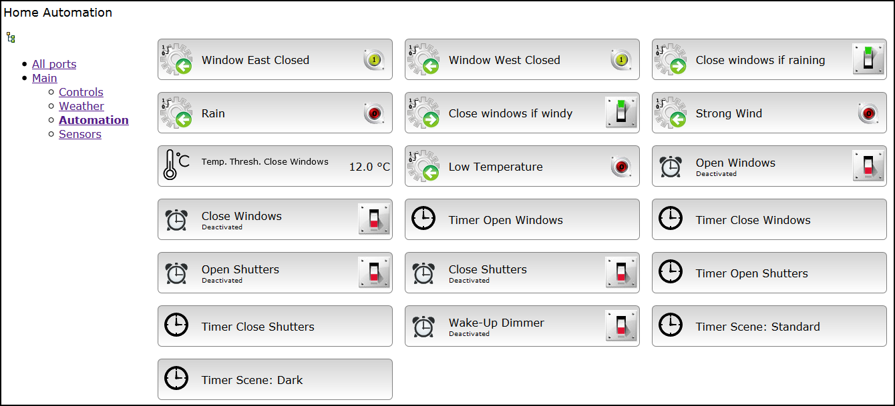
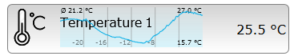

## Overview

openhatd, the **Open Home Automation Toolkit server**, is an open source, cross-platform automation server written in C++11. It can be configured for a variety of automation tasks. Features are:

 - Ideally suited for Raspberry Pi and other small Linux based systems
 - Configuration files in INI file format
 - Controllable via an Android app or HTML/Javascript (with a JSON-RPC web service API)
 - Supports a plugin architecture for extensibility
 - Can control a variety of actors, for example relays or dimmers
 - Accepts input from a variety of sources, for example switches, buttons, and A/D converters
 - Supports scenes for predefined combinations of settings
 - Can store user settings for persistence over restarts
 - Has plugins for:
	 - Raspberry Pi [Gertboard](https://www.sparkfun.com/products/retired/11773) I/O board with an onboard microcontroller as a port expander
	 - Weather station support (interoperates with the Weewx open source weather station software, see: [http://weewx.com](http://weewx.com))
	 - Window and shutter control with a variety of options
	 - FRITZ!Box smart home device support, e. g. [FRITZDECT!200](https://en.avm.de/products/fritzdect/fritzdect-200/)
	 - An integrated web server with JSON-RPC API
	 - Radio-controlled power sockets (experimental)
 - Built-in functions:
	 - Timer that supports periodical, astronomic (sunset/sunrise) or manual scheduling
	 - Expression engine for complex mathematical calculations
	 - Interoperation with the OS: Monitor files to read input, execute OS commands
	 - Logic functions for changing outputs based on logical conditions
	 - Pulse with configurable duration and duty cycle
	 - Fader for smooth control of e. g. dimmers
	 - Statistical aggregator for calculations of means etc.
	 - Trigger that is activated when inputs change
	 - Connector to InfluxDB for collecting statistics
	 -  and more

openhatd allows you to monitor and control the state of sensors and actors such as lamps, fans, dimmers, windows and shutters, radio-controlled power sockets, weather sensors, electric, gas and water meters and more.

Typical use cases in home automation include:

 - Provide central access to numerous actors and sensors 
 - Open or close windows and shutters manually or timer-controlled
 - Automate processes: Ensure that windows stay closed when it rains or if it is too cold outside
 - Switch on the lights or fade in a dimmer in the morning
 - Display current meter values and water or energy consumption statistics
 - Control heating equipment  

openhatd is a part of the [OpenHAT project](http://www.openhat.org). It is mostly licensed under the Mozilla Public License but may contain parts using other licenses. 

## Example Screenshots

### Android GUI (AndroPDI remote control)

### Web GUI

Automatically collected history data on the Web GUI:

### InfluxDB time series data visualized using Grafana

## Getting started

You can test openhatd on Windows or Linux first before deploying it in a "real" home automation system. [Download and install](download.md) the proper version for your operating system. Open a command line prompt, go to the installation directory and start openhatd:

	$ openhatd -c hello-world.ini

When openhatd has started you can open the web GUI using a browser. Go to [http://localhost:8080](http://localhost:8080).

To control openhatd using an Android device, download and install the AndroPDI Remote Control app on the device. You may have to temporarily allow the installation of third-party apps. Start the app and create a new TCP/IP device entry. Enter the name or IP address of the machine running openhatd as the host name. The default port is 13110. Tap the device entry to open a connection to openhatd. After connecting, tap it again to view the list of ports exposed by openhatd and play with them.

To become familiar with the possibilities of openhatd please start with [Basic Concepts](concepts.md). You should then read up on the [ports](ports.md) provided by openhatd and how to [configure](configuration.md) the system before having a look at the [automation examples](automation_examples.md).

## More information

